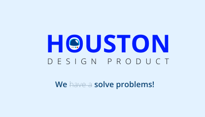

# Eduzz Houston Mobile UI Components


[](https://github.com/eduzz/houston/actions/workflows/master.yml) [](https://www.npmjs.com/package/@eduzz/houston-mobile)



## Installation

```sh
yarn add @eduzz/houston-mobile-ui
```

## Usage

```js
import { Modal } from '@eduzz/houston-mobile-ui';

// ...

<Modal visible={visible} onRequestClose={closeModal}>
  ...
</Modal>
```

## Examples

```sh
# Android app
yarn example android
# iOS app
yarn example ios
```

## Components

* [Modal](https://github.com/eduzz/houston-mobile/tree/master/packages/ui/src/Modal)
* [ActionSheet](https://github.com/eduzz/houston-mobile/tree/master/packages/ui/src/ActionSheet)
* [ActionItem](https://github.com/eduzz/houston-mobile/tree/master/packages/ui/src/ActionSheet/ActionItem)


## License

MIT